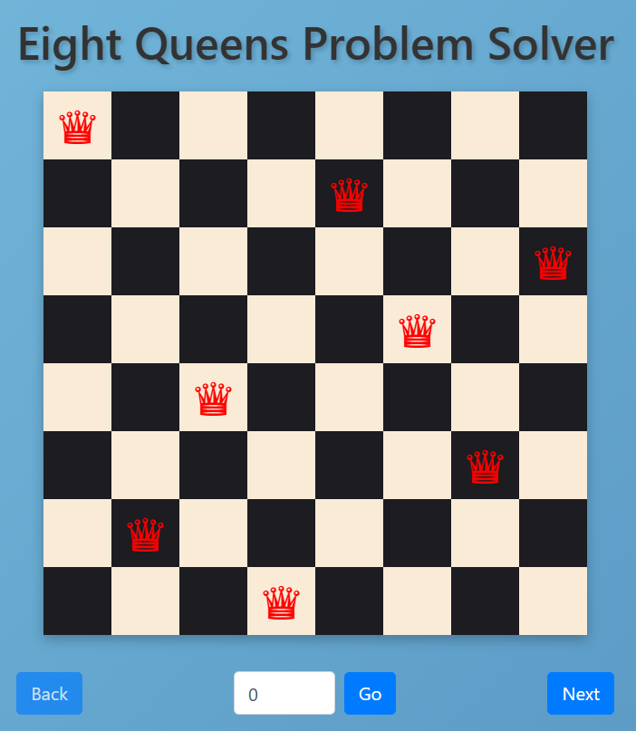

# Eight Queens Problem Solver

This project provides a solution to the classic Eight Queens Problem using Java and Spring Boot. The application allows users to visualize all possible solutions where eight queens are placed on a chessboard such that no two queens threaten each other.

## Demo

 

*Screenshot of the application displaying one of the solutions*

## Features

- Computes and displays all valid solutions to the Eight Queens puzzle.
- Interactive web interface for navigating through solutions.
  
## Technologies Used

- **Java 23**
- **Spring Boot**
- **Thymeleaf** for server-side rendering
- **Bootstrap** for responsive web design
- **Docker** for containerization

## Getting Started

### Prerequisites

Choose one of the two methods to run the application. The requirements differ depending on your choice:

1. **If using Maven:**
   - Java 17 or newer
   - Maven 3.8.1 or newer

2. **If using Docker:**
   - Docker installed on your machine

### Installation & Running the Application

#### Option 1: Using Maven

1. **Clone the repository:**
   ```bash
   git clone https://github.com/AdelinV2/eight-queens-spring-boot.git
   ```
2. **Navigate to the project directory:**
   ```bash
   cd eight-queens
   ```
3. **Build the project:**
   ```bash
   ./mvnw clean package
   ```
4. **Run the application:**
   ```bash
   java -jar target/eight-queens-0.0.1-SNAPSHOT.jar
   ```
5. **Access the applcation:**
   Open your browser and navigate to [http://localhost:8080](http://localhost:8080)

### Option 2: Using Docker

1. **Pull the pre-built Docker Image:**
   ```bash
   docker pull ghcr.io/adelinv2/eight-queens-spring-boot:latest
   ```
2. **Run the container:**
   ```bash
   docker run -p 8080:8080 ghcr.io/adelinv2/eight-queens-spring-boot:latest
3. **Access the applcation:**
   Open your browser and navigate to [http://localhost:8080](http://localhost:8080)

